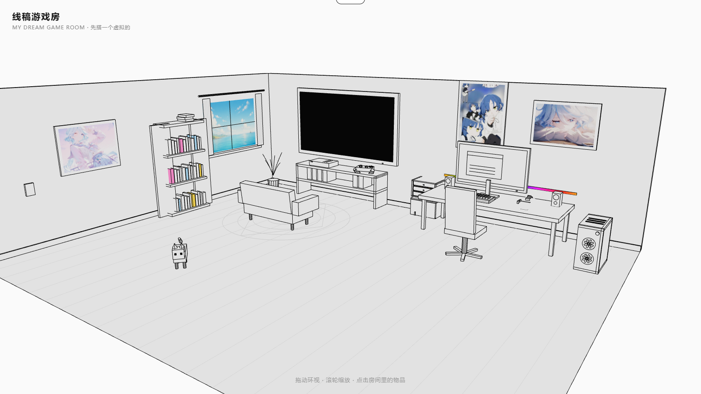
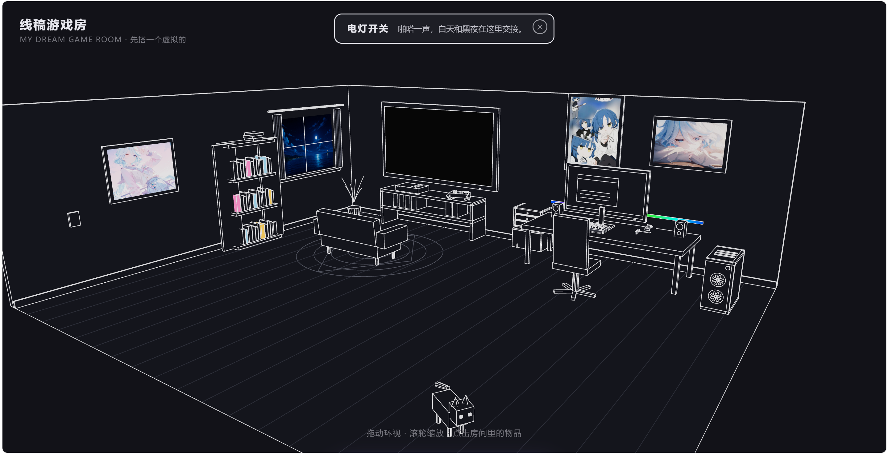

# Dream Gaming Room · 线稿游戏房

一间可以用鼠标逛来逛去的 3D 线稿风游戏房 —— 纯代码建模，没有使用任何外部 3D 模型文件，所有物体都由方块、圆柱、平面和线条拼成，像一本可以走进去的立体漫画书。

## 截图预览

| 白天 | 黑夜 |
| :---: | :---: |
|  |  |

## 功能特性

- **线稿渲染风格**：无光照材质 + 棱角描边，画面干净如漫画底稿
- **白天 / 黑夜一键切换**：点击墙上的开关，全屋配色、窗外景色（海岸日出 / 星空夜晚）随之切换
- **可交互物品**：点击书架、电脑、游戏机等物品，触发对应动画（开关灯、RGB 流光、电视、窗帘等）
- **立体声音响**：播放本地音乐，LRC 歌词以 3D 浮动文字形式同步显示在房间里
- **RGB 流光效果**：键盘、机箱灯带使用彩虹渐变贴图无限流动
- **会跑的电视屏幕**：电视上的跑酷小游戏由 Canvas 逐帧实时绘制
- **一只猫**：会自己散步、呼吸、摇尾巴，用的是 GSAP 补间动画
- **仪式感入场镜头**：相机从高空缓缓俯冲进入房间，随后解锁轨道相机自由环视

## 技术栈

| 技术 | 用途 |
| --- | --- |
| React 19 + TypeScript |  UI 与组件化 |
| Three.js + React Three Fiber + drei | 3D 场景渲染 |
| GSAP | 补间动画（窗帘、猫、镜头等） |
| Zustand | 全局状态管理（昼夜、信息面板等） |
| Vite | 构建与开发服务器 |

## 快速开始

```bash
# 安装依赖
npm install

# 启动开发服务器
npm run dev

# 构建生产版本（含 TS 类型检查）
npm run build
```

## 项目结构

```
src/
├── App.tsx              # 组装整个 Canvas 场景
├── camera/CameraRig.tsx # 轨道相机与入场镜头动画
├── scene/               # 3D 场景：房间、家具、设备、猫、海报、线稿组件
├── ui/                  # DOM 界面层：操作提示、自定义光标、音响控制台
├── audio/               # 音乐播放与 LRC 歌词解析
├── data/                # 配色、海报、小说、曲目等数据
└── store/               # Zustand 全局状态
```

## 部署

这是一个标准的 Vite 单页应用，可直接部署到 Vercel，无需额外配置：

```bash
npm i -g vercel
vercel --prod
```

构建命令 `npm run build`，产物目录 `dist`，Vercel 会自动识别。

## 更多

关于本项目的技术细节与实现思路（线稿描边、Canvas 贴图、射线拾取、相机动画等），见博客文章：[用 React Three Fiber 搭一间"线稿游戏房"](docs/threejs-game-room-blog.md)
